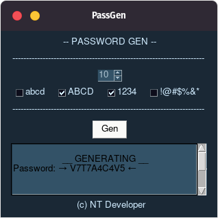

# PassGen-py

## 🗂 Project description

	This software is a password generator, in which you choose the types of characters, and the length of the password.

 

### 🖼 Image project
#### PassGen-v1

#### PassGen-v2

 

### 🛠 Technology

<li> Python
<li> PySimpleGUI

 

### 💾 Instalação

<h5>Mac e Linux</h5>

~~~ Bash
    python3 -m pip install PySimpleGUI
    or
    pip3 install PySimpleGUI
~~~

<h5>Windows</h5>

~~~ PowerShell
    python -m pip install PySimpleGUI
~~~

### ✔ Status

<h4>finished!</h4>

<footer>&copy; NT Developer</footer>
